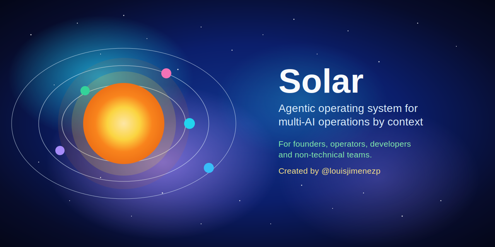

# Solar



> 🧪 Beta: Solar is under active development. Expect fast iteration and frequent improvements.

Solar is an agentic operating system built on a Sun-Planets architecture 🌞🪐:

- `Sun`: a central personal agent that routes tasks.
- `Planets`: domain agents with local governance ⚖️.

It provides standard delegation contracts 🤝, onboarding templates, and operational rules for multi-AI operations by context with clear boundaries 🧭.

Solar is designed for founders, operators, developers, and non-technical teams who need reliable execution across contexts.

Solar is created by [@louisjimenezp](https://github.com/louisjimenezp) and maintained by [Uhorizon AI](https://uhorizon.ai).

## 🌍 Open Source and Commercial Model

Solar is free and open source.
Licensed under Apache License 2.0. See [`./LICENSE`](./LICENSE).

- Use it for personal and professional workflows.
- Contribute improvements through issues and pull requests.
- If you need implementation help, Uhorizon AI offers paid services.

Primary commercial CTA:
- Book a setup or migration call with Uhorizon AI: https://uhorizon.ai/contact

Optional support:
- Donations are optional and help sustain maintenance.
- Support Solar directly:
  - 💸 PayPal: [@louisjimenezp](https://www.paypal.com/paypalme/louisjimenezp)
  - ☕ Buy Me a Coffee: [@louisjimenezp](https://buymeacoffee.com/louisjimenezp)
- See [`./SUPPORT.md`](./SUPPORT.md) for details.

## 🌞 Why Solar

A single assistant does not handle real context boundaries well. Solar separates domains by design so each context can evolve with clear governance, memory, and execution rules across multiple AI systems.

## 🧰 Recommended Setup (Best Experience)

To get the best experience with Solar, use:

- One AI coding client:
  - 🤖 Claude Code
  - 🤖 Codex
  - 🤖 Gemini
- 🖥️ VS Code as your main interface.
- Relevant VS Code extensions for your selected client (Claude Code, Codex, or Gemini Code) so you can interact with multiple AI workflows directly against this repository.

## ⚡ What You Can Do with Solar

- Keep one personal command center (`Sun`) and route tasks to specialized domain workspaces (`Planets`).
- Enforce different governance rules per domain without mixing context.
- Operate multiple AI clients (Claude, Codex, Gemini) within one consistent operating model.
- Reuse common templates, contracts, and skills across projects.
- Scale from solo workflows to multi-project operations.

## 🧭 Example Use Cases

- Founder operations: sales outreach, content planning, and delivery coordination in separate planets.
- Agency model: one planet per client with independent memory, governance, and execution boundaries.
- Product + business split: keep engineering, go-to-market, and internal operations in distinct contexts.

## 🚀 Quickstart

1. Clone the repository:
```bash
git clone git@github.com:Uhorizon-AI/Solar.git
```
2. Open Visual Studio Code, open this repository, and say `hello`.

## 🛰️ How It Works

1. You request a task to the Sun.
2. The Sun routes it to the right Planet.
3. The Planet executes with domain-specific governance.
4. The Planet returns status and next steps.

## 🤝 Contributing

Contributions are welcome.

1. Read [`./CONTRIBUTING.md`](./CONTRIBUTING.md).
2. Open an issue for bugs or feature proposals.
3. Submit focused pull requests.

Starter labels for first contributions:
- `good first issue`
- `help wanted`

## 🛡️ Security and Community

- Security reports: [`./SECURITY.md`](./SECURITY.md)
- Code of conduct: [`./CODE_OF_CONDUCT.md`](./CODE_OF_CONDUCT.md)
- Support channels and response model: [`./SUPPORT.md`](./SUPPORT.md)

## 🏷️ Brand Usage

Use the project name as:
- Product: `Solar`
- Attribution: `Solar by Uhorizon AI`
- Optional creator attribution: `Created by @louisjimenezp` (https://github.com/louisjimenezp)

## 📬 Team and Contact

- Created by [@louisjimenezp](https://github.com/louisjimenezp)
- Maintained by [Uhorizon AI](https://uhorizon.ai)
- Commercial and general inquiries: https://uhorizon.ai/contact
