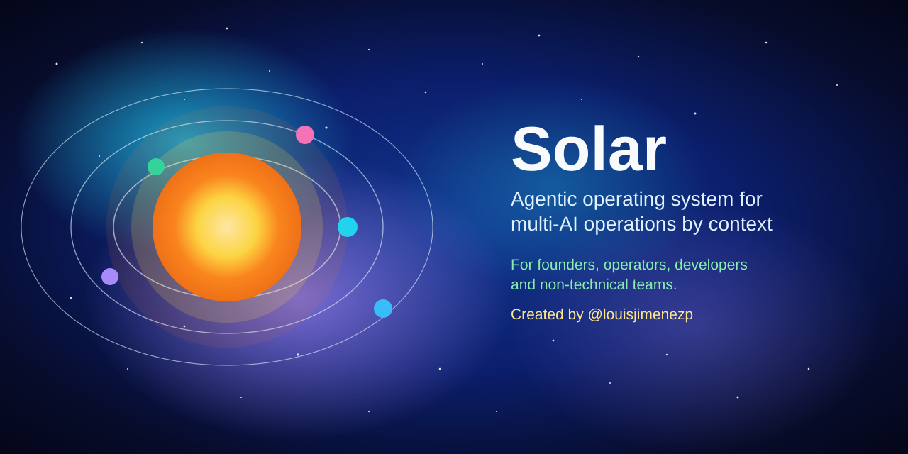

<p align="center">
  
</p>

<p align="center">
  <a href="#quickstart"><strong>Quickstart</strong></a> &middot;
  <a href="https://github.com/Uhorizon-AI/Solar"><strong>GitHub</strong></a> &middot;
  <a href="https://uhorizon.ai/contact"><strong>Contact</strong></a>
</p>

<p align="center">
  <a href="https://github.com/Uhorizon-AI/Solar/blob/main/LICENSE"></a>
  <a href="https://github.com/Uhorizon-AI/Solar/stargazers"></a>
</p>

<br/>

> 🧪 **Beta:** Solar is under active development. Expect fast iteration and frequent improvements.

<br/>

# What is Solar?

## An Open-source AI Operating System for multi-agent workflows

**If an AI agent is an _employee_, Solar is the _Operating System_ unifying the team.**

Solar orchestrates multi-agent workflows across different contexts and domains. Just like a traditional OS manages processes and resources, Solar routes tasks, abstracts disparate AI providers (Claude, Codex, Gemini), manages domain-specific memory, and enforces governance. 

It is built on a **Sun-Planets architecture** 🌞🪐:
- **Sun**: Central personal agent that routes tasks and maintains global context.
- **Planets**: Domain-specific agents with localized governance and execution rules.

**Manage contexts and boundaries, not just prompts.**

|        | Step            | Example                                                            |
| ------ | --------------- | ------------------------------------------------------------------ |
| **01** | Define domains  | _Create a "Planet" for Engineering, Sales, and Operations._ |
| **02** | Add your AIs    | Connect Claude, Gemini, or Codex as your core agents. |
| **03** | Route and run   | The "Sun" receives tasks and routes them to the exact planet with the right domain memory.  |

<br/>

## Solar is right for you if

- ✅ You operate **multiple AI clients** (Claude, Codex, Gemini) and need a consistent operating model.
- ✅ You want to enforce **different governance rules** per domain without mixing contexts.
- ✅ You need to scale from **solo workflows to multi-project operations**.
- ✅ You are a founder, operator, or developer who relies on AIs to **execute reliable workflows**.
- ✅ You want to reuse **common templates, contracts, and skills** across your projects.

<br/>

## Features

<table>
<tr>
<td align="center" width="33%">
<h3>🌞 The Sun (Router)</h3>
Your central interface. Receives incoming tasks and smartly routes them to the correct context (Planet). 
</td>
<td align="center" width="33%">
<h3>🪐 Pluggable Planets</h3>
Isolated domain workspaces. Each planet has its own specialized agents, rules, and memory to execute locally.
</td>
<td align="center" width="33%">
<h3>🤖 Unified Runtime</h3>
Bring your own AI provider (Claude, Codex, Gemini). A single consistent runtime interacts across everything.
</td>
</tr>
<tr>
<td align="center">
<h3>📜 Strict Governance</h3>
Explicit rules and delegation contracts. The Sun enforces user preferences, Planets enforce domain rules.
</td>
<td align="center">
<h3>🧠 Isolated Memory</h3>
No more cross-contamination of context. Your coding agent doesn't see your sales emails unless explicitly routed.
</td>
<td align="center">
<h3>🛠️ Reusable Skills</h3>
Define tools, skills, and templates in the Core, then effortlessly deploy them across your Planets.
</td>
</tr>
</table>

<br/>

## Problems Solar solves

| Without Solar                                                                                                                     | With Solar                                                                                                                         |
| ------------------------------------------------------------------------------------------------------------------------------------- | -------------------------------------------------------------------------------------------------------------------------------------- |
| ❌ Your AI assistant mixes context between your SaaS product code and your client sales emails.                              | ✅ Context is completely isolated. Code stays in the Engineering planet, Sales stays in the Go-To-Market planet.                                                |
| ❌ Changing between Claude, Gemini, and Codex means rewriting your workflow scripts or dealing with completely different logic. | ✅ The OS abstracts the provider. You get a unified runtime regardless of which AI acts inside the planet.                  |
| ❌ You spend time babysitting AI loops or finding out your AI hallucinated because it applied general rules to a specific domain. | ✅ Governance is layered. Global rules override framework rules, domain rules override global rules. AIs know exactly how to behave. |
| ❌ Replicating an AI workflow for 5 different clients involves copy-pasting system prompts across 5 different tools.                           | ✅ One framework. Spin up a new Planet for each client. Each inherits core capabilities but retains private memory.                    |

<br/>

## Why Solar is special

|                                   |                                                                                                               |
| --------------------------------- | ------------------------------------------------------------------------------------------------------------- |
| **Sun-Planet Architecture.**      | Clear boundary between global routing (Sun) and local execution (Planets).                       |
| **JIT Delegation.**               | Autonomous self-assessment. If the AI lacks context, it immediately routes the task to the right specialist.                   |
| **Framework vs Runtime Splitting.** | Strict separation between reusable framework artifacts (`core/`) and user-owned domain data (`planets/`). |
| **Validation Gates.**             | Tasks that modify data or send messages trigger explicit approval stops. No runaway actions.                 |

<br/>

## What Solar is not

|                              |                                                                                                                      |
| ---------------------------- | -------------------------------------------------------------------------------------------------------------------- |
| **Not a Chatbot Interface.** | Solar is an OS running inside your code editor (like VS Code), managing files, skills, and workflows directly.  |
| **Not locked to one LLM.**   | We orchestrate. The intelligence comes from the providers you interact with.                                |
| **Not a closed ecosystem.**  | You own the platform. Build your own planets, customize your agents, use standard bash and Node.js tools.            |

<br/>

## Works with

<div align="center">
<table>
  <tr>
    <td align="center"><strong>Works<br/>with</strong></td>
    <td align="center"><a href="https://claude.ai/code"><br/><sub>Claude Code</sub></a></td>
    <td align="center"><a href="https://github.com/openai/codex"><br/><sub>Codex</sub></a></td>
    <td align="center"><a href="https://gemini.google.com/"><br/><sub>Gemini</sub></a></td>
    <td align="center"><a href="https://cursor.com"><br/><sub>Cursor</sub></a></td>
    <td align="center"><a href="https://ollama.com"><br/><sub>Ollama</sub></a></td>
  </tr>
</table>
</div>

<br/>

## 🚀 Quickstart

### Install Solar (users)

Requires macOS, Git, Bash, Python 3, and curl. Same shape as Claude Code / Codex: one global `solar` on your `PATH`, framework data under `~/.local/share/solar`, workspace = any folder you choose. The installer does **not** edit your shell profile.

<!-- solar-bootstrap-pin -->
```bash
curl -fsSL https://raw.githubusercontent.com/Uhorizon-AI/Solar/v0.20.1/core/skills/solar-client/scripts/bootstrap_solar_client.sh | bash
```
<!-- /solar-bootstrap-pin -->

If the installer reports that `~/.local/bin` is not on your `PATH`, add it and open a new shell:

```bash
export PATH="$HOME/.local/bin:$PATH"
```

Then open any project folder and set it up as a Solar workspace:

```bash
mkdir -p ~/Solar
cd ~/Solar
solar setup
```

(`solar setup` runs init + sync + doctors. You can use `~/Projects/acme` or any other directory instead of `~/Solar`.)

The bootstrap URL above is pinned to a release tag by `create-release` (do not edit by hand). Runtime installs resolve the latest stable GitHub Release via the API.

### Contribute to the framework (developers)

```bash
git clone https://github.com/Uhorizon-AI/Solar.git
cd Solar
```

SSH alternative: `git clone git@github.com:Uhorizon-AI/Solar.git`

Open the repo in your editor and follow contributing docs. Cloning the framework is **not** the same as installing the product.

<br/>

## 🧭 Example Use Cases

- **Founder Operations:** Keep product engineering, sales outreach, and content delivery coordinated in completely separate planets.
- **Agency Model:** Spin up one planet per client with independent memory, API keys, and execution boundaries.
- **Personal OS:** Manage your personal life in `/sun/` and your professional projects in `/planets/`.

<br/>

## 🌍 Open Source & Commercial

Solar is open source and licensed under Apache License 2.0. See [`LICENSE`](./LICENSE).

Use it for your personal workflows, or bring it to your company. 

**Need help setting it up or integrating it at scale?**
- 🤝 [Book a setup or migration call with Uhorizon AI](https://uhorizon.ai/contact)

If you love Solar, consider supporting its maintenance:
- 💸 PayPal: [@louisjimenezp](https://www.paypal.com/paypalme/louisjimenezp)
- ☕ Buy Me a Coffee: [@louisjimenezp](https://buymeacoffee.com/louisjimenezp)

<br/>

## 🤝 Contributing

Contributions are welcome!
1. Read our [`CONTRIBUTING.md`](./CONTRIBUTING.md).
2. Open an issue for bugs or feature proposals.
3. Submit focused pull requests (Look for `good first issue` or `help wanted` tags).

*Security reports: [`SECURITY.md`](./SECURITY.md) | Code of conduct: [`CODE_OF_CONDUCT.md`](./CODE_OF_CONDUCT.md)*

<br/>

## Star History

[](https://star-history.com/#Uhorizon-AI/Solar&Date)

<br/>

---

<p align="center">
  <sub>Solar by Uhorizon AI. Created by <a href="https://github.com/louisjimenezp">@louisjimenezp</a></sub><br/>
  <sub>A unified AI Operating System for people who run multiple contexts.</sub>
</p>
