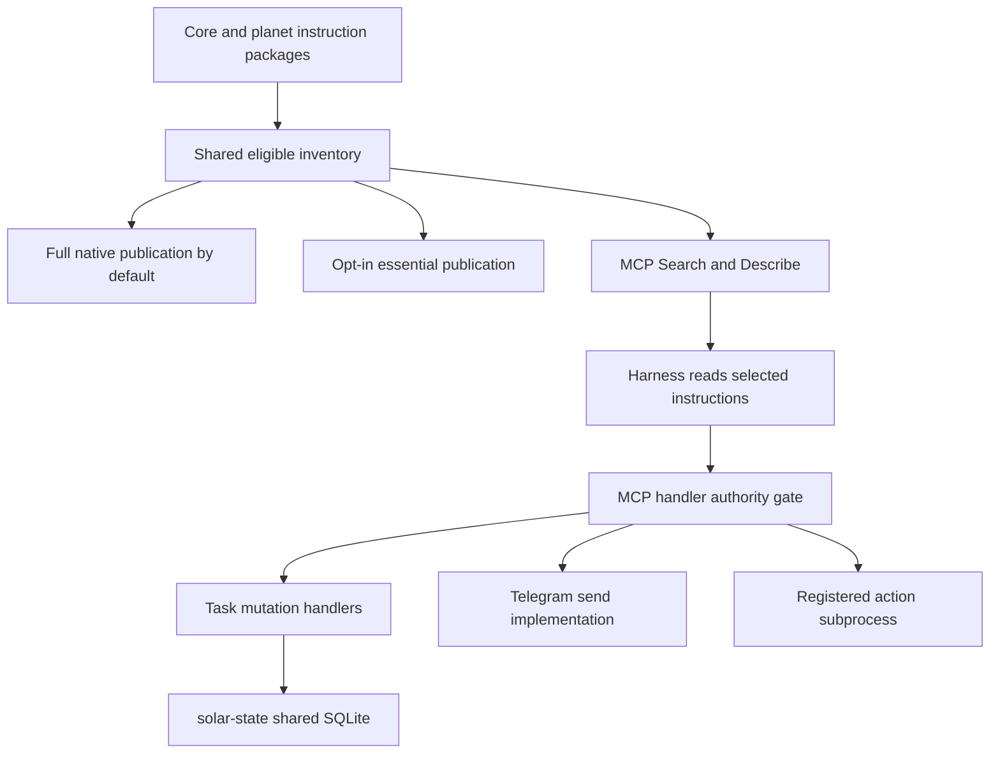

# Small-door capability discovery

**Status:** implemented in draft PR; rollout pending maintainer review.
**Scope:** single-workspace stdio MCP, opt-in Codex catalog reduction only. Native publication remains the default.

## What the first delivery does

1. `skill_inventory.py` supplies the same eligible instruction IDs to Client
   publication and MCP discovery. Core IDs are unprefixed; planet IDs use
   `planet:skill`, including nested packages. Sorted first-match resolution
   preserves the existing duplicate-name convention. `sync: false`, planet
   exclusions and skill exclusions apply to both Search and Describe.
2. MCP Search returns bounded descriptions and source hashes. Describe reads
   one selected instruction unit or a registered Markdown reference. A unit
   over 4 KiB returns a heading outline with the preamble and governance
   sections in full; `section` and `full` read original text. These tools find
   instructions; they do not execute them or mint authority.
3. Client's opt-in `discovery` profile publishes three mandatory essentials to
   `.agents/skills`: `solar-mcp`, `solar-client`, `solar-paths`, plus explicitly
   selected essentials. Eligible unpublished packages remain discoverable.

One Client settings tree is retained. No agent checkpoint table, schema
migration, router recovery, per-planet `.solar`, physical database per agent or
new multiuser isolation is part of this PR. Responsibility continuity is an
independent deferred delivery after existing-state recovery is demonstrated.

## Actual routes and enforcement



Only task mutation handlers write SQLite on these paths.
`_do_telegram_send` and `_do_action_run` do not write that database; their
subprocesses own their effects. Existing gate audit/approval files remain in
the MCP runtime. Discovery reads sources and does not rebuild a persistent
registry or initialize runtime, though the existing handler logs read verdicts.

Browser, shell and native harness tools can still operate outside this gate.
This feature does not extend MCP enforcement to those routes. Instruction
packages remain instructions; registered action skills remain a separate list.
`metadata.skills` does not inject descriptions: the provider harness discovers
skills. The router resolves agent roles. Existing seven verbs retain their
original argument validation; discovery validates its own two contracts only.

## Contracts and safeguards

| Surface | Contract |
|---|---|
| Search | Non-empty query, at most 512 characters; integer limit of at least 1 (default 5); values above 10 are applied as 10 and the response sets limit_capped; descriptions at most 120 characters, cut on a word boundary; exact IDs supported; namespace preference affects ranking only; result JSON bounded below 8 KiB |
| Describe | Known eligible ID, optional expected main revision, optional allowlisted `references/*.md` key, optional exact section title, optional full; units of 4 KiB or less and full=true return the complete text; larger units return a heading outline with the preamble and governance sections copied in full; governance is a case-insensitive substring listed in the discovery reference, including the Spanish rule markers; section and reference do not accept paths; unit source at most 60,000 bytes and result JSON at most 64 KiB; oversized units, preamble, and governance text refuse instead of being cut |
| Visibility | Both tools derive eligibility from the workspace bound by the server; excluded IDs cannot be described directly |
| Paths | Canonical roots, traversal refusal and symlink containment checked on reads; search returns no absolute source paths |
| Dependencies | Availability is reported as unknown; retrieving a package does not establish readiness |

The inventory is a live read-only scan, not a persisted snapshot. Main source
hashes reject stale expected revisions. Each returned reference also has a unit
hash; reference keys must come from Describe. No caller path or URL is opened.
Unsafe or malformed individual packages are skipped with a warning so eligible
packages still sync; the same unavailable IDs cannot be described. Invalid
settings still refuse the entire operation.

## Activation and rollback

Use supported Client commands, never manually edit `.solar`:

```bash
solar client sync profile show
solar client sync profile set discovery --codex-only --dry-run
solar client sync profile set discovery --codex-only --essential demo:analysis
solar client sync --codex-only
# Revert native exposure:
solar client sync profile set native
solar client sync --codex-only
```

The dry-run reports catalog counts and ID/description bytes, not provider
usage. Before saving or pruning, discovery mode probes the actual registered
Codex Solar stdio MCP for Search/Describe and its workspace binding. Missing
registration, missing essentials or an unmanaged essential collision refuses.
Only Client-managed copies are pruned; personal resources are preserved. Profile
set uses the canonical atomic Client writer to refresh installation identity and
remove stale portable keys; portable-mode profile changes currently refuse.

The profile affects `.agents`, shared by Codex and Antigravity. Antigravity MCP
registration is unsupported. Discovery set requires an explicit `--codex-only`
choice and warns that Antigravity must not use this workspace until native is
restored. A sync including Antigravity (including the default all-client sync)
refuses before publication or pruning. Claude, Cursor and Gemini retain full
catalogs when synced individually. Production activation remains outside this PR.

## Why these pieces belong together

A smaller initial catalog can lower initial context exposure; adding Search
while keeping all advertised entries does not remove that exposure. MCP then
retrieves only selected descriptions, instructions and references.

MCP gates control mediated effects, not token usage. Shared MCP processes can
reduce process overhead but do not themselves shrink model input. Cache hits
can lower billing without reducing occupied context. Search calls
also add calls, latency and input, so catalog byte reduction is insufficient
to prove economic savings. Router `prompt_chars` is not total harness context.

## Catalog baseline and session comparison

Read-only measurement on 2026-10-07: 160 eligible packages, **68,386 UTF-8 bytes**
of ID plus description (427 bytes/package); three mandatory essentials total
**823 bytes**. The reduced count/bytes are an in-memory preview, without
activation or MCP/harness validation. At an illustrative four bytes/token the
full list would be roughly 17,000 tokens; this is arithmetic, not tokenizer data.

Fresh full/reduced Codex sessions on identical tasks remain pending: initial
harness-injected catalog, input/cached/output tokens, tool calls, latency, cost
and completion quality are **unknown**. The comparison procedure and recording
matrix live in the [profile reference](../skills/solar-client/references/discovery-profile.md).
These byte totals omit schemas, formatting, prompts and selected reads.

## Review and rollout criteria

The task remains **in review** while this draft PR is open. Isolated tests must
cover native regression, real stdio discovery, profile transitions and refusal,
visibility/path/revision/size checks, canonical settings writes, unsafe-package
skipping, Antigravity refusal and unchanged behavior of existing verbs.

The **framework maintainer** owns approval of essential membership and a fixed
representative task set, plus latency and cost targets from a full-profile
baseline **before** comparing profiles. The implementer supplies measurements;
the maintainer evaluates them rather than letting the implementer both set and
accept their own thresholds. A fresh Codex session must verify explicit skill
invocation, successful selected work, initial catalog reduction and rollback.
Record input/cached/output tokens when exposed, calls, latency and completion
quality; missing measurements remain unknown. No rollout or token-saving
percentage is accepted solely from synthetic bytes or isolated fixtures.

Shared HTTP transport needs its own authenticated session/approval design.
Code Mode needs its own connector and execution controls. Neither is required
for this delivery and neither is implemented here.

Related: [task](../../docs/tasks/2026-10-07-small-door-discovery.md),
[token/session protocol](token-budget-protocol.md),
[authority model](authority-model.md),
[Client profile](../skills/solar-client/references/discovery-profile.md),
[MCP discovery](../skills/solar-mcp/references/discovery.md).
